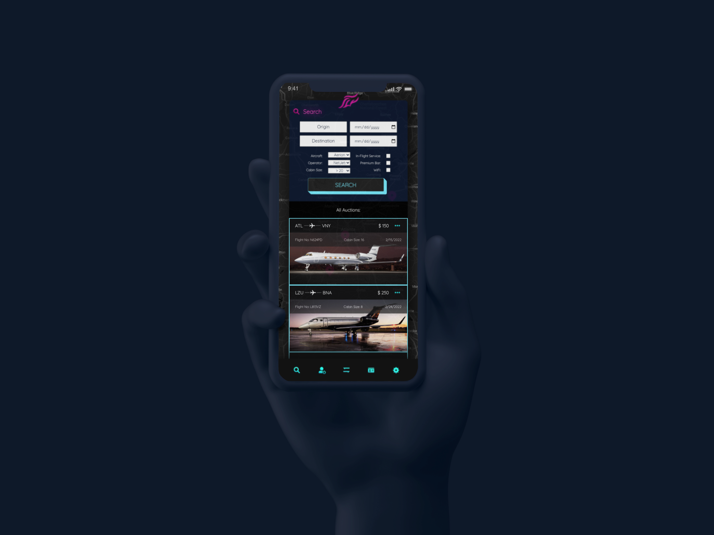
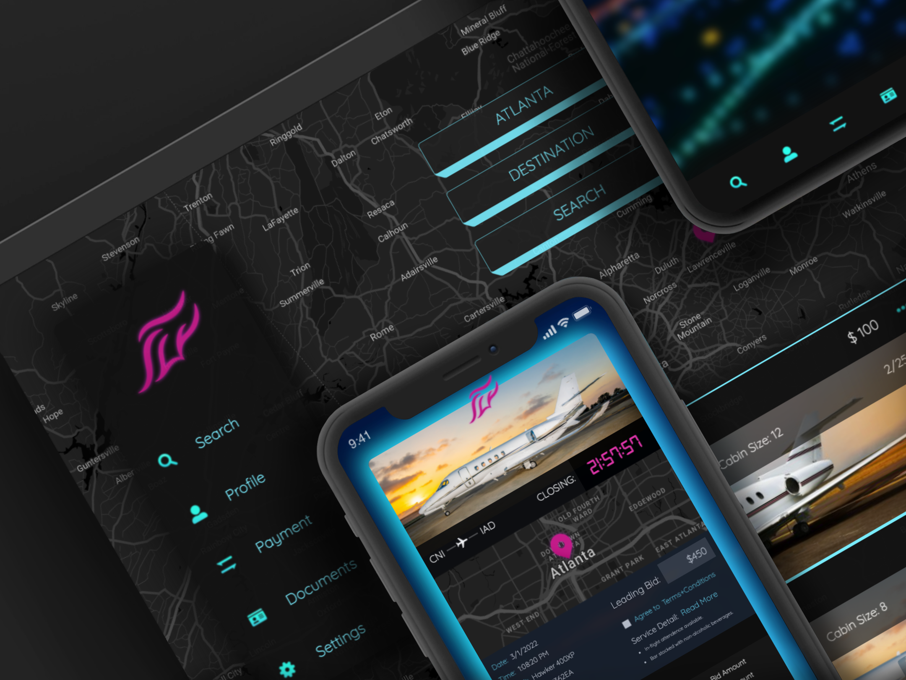

# fly-app

🛩️ 🛩️ 🛩️ 🛩️

<br />

## Table of Contents

- [Description](#description)
- [User Story](#user-story)
- [Demo](#demo)
- [Deployment](#deployment)
- [License](#license)
- [Criteria](#criteria)
- [Collaboration](#collaboration)

<br />

## Description

Everyday there is some executive or celebrity booking private air travel. These individuals pay enormous rates for the priviledge of avoiding commercial. However, more than 30% of these bookings result in what is known as an "empty leg". This means a jet travels to the client EMPTY! These Empty legs are currently being marketed at "a discount" by the same brokers booking at market rate. No surprise the cost is not far from retail, and flights often still remain empty in-route to market-rate clients.

Fly App seeks to solve this problem by auctioning off empty legs, opening up the industry to a middle-class market that never could have afforded such a travel option. Users can view active auctions, login to place a bid, and as timer expires, can proceed to secure checkout. A simple solution that seeks eliminate the private jet brokeage industry, making luxury travel affordable to a new market sect, while helping to reduce such drastic waste caused by empty leg flights traveling throughout our airspace.

<br />
<br />

## User Story

```
AS A frequent flyer
I WANT to book a private air travel at an affordable rate
SO THAT I can experience a new level of luxury and convenience
```

<br />
<br />

## Demo

[](https://youtu.be/.../)




<br />
<br />

## Deployment

**Visit Materials Trader on Heroku:**

[](https://fly--app.herokuapp.com/)

<br />

**Employing the following technology:**

[](https://www....)
[](https://www....)
[](https://www....)
[](https://www....)

[](https://www....)
[](https://www....)

<br />
<br />

## License

All Rights Reserved

<br />
<br />

## Criteria

```
homepage displays left nav on desktop and bottom nav on mobile.

nav provides links to search, profile (login/sign-up), payment, documents, and settings.

search fields are displayed at top-center with options to input origin/destination cities, and button to search.

below search fields at bottom center is a vertically scrollable container listing auction matches departing soon.

homepage background displays google map with plotpoints for auctions departing soon.

profile tab links to login or signup screen, or profile page if logged-in.

profile icon displays logged in status in nav.

profile page displays user data, with option to add profile picture, update, change password, and logout.

profile page lists all open bids, user watchlist, payment methods, uploaded documents, and setting preferences.

search page lists all auctions, with inputs to filter by aircraft, operator, cabin size; and checkboxes for additional service.

all listed auction cards, click through to auction detail page.

auction detail displays timer counting down to the end of auction.

auction page includes full details, including bid history, T&C checkbox and links to full terms and service options.

auction displays link to watch bid, input field to enter bid, and button to submit bid or checkout.

Logging out routes to homepage.
```

<br />
<br />

## Collaboration

<br />

Julius Markauskas  
email:juliusm9791@gmail.com

<a href= "https://github.com/Juliusm9791"></a>

<br />

Vince Momot  
 email:vincemomot@gmail.com

<a href= "https://github.com/VincentMomot"></a>

<br />

Todd Trulock  
email:toddstrulock@gmail.com

<a href= "https://github.com/ttrulock1"></a>

<br />
<br />
Thanks for flying with us!

🧑‍✈️
